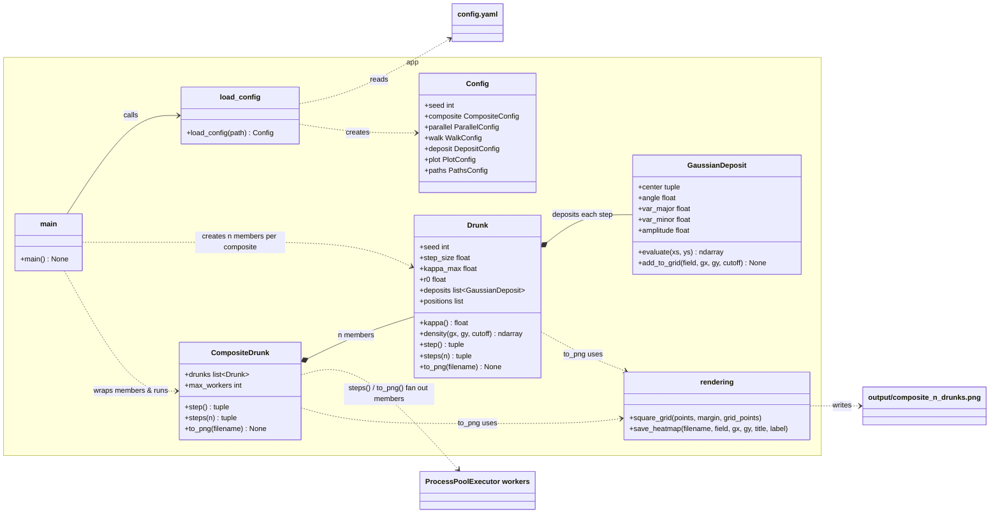
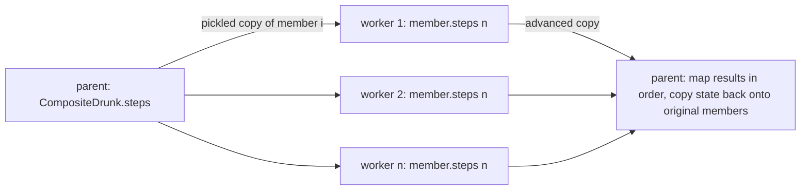

# drunk

## Overview

A simple 2D random-walk ("drunkard's walk") simulator. Each `Drunk` starts at the origin and, on
every step, staggers a fixed distance in a random direction that is biased back towards home, and
deposits a randomly oriented 2D Gaussian at its new location. A `CompositeDrunk` groups several
already-constructed drunks, runs them in parallel worker processes, and renders the sum of all their
deposits. The program builds three composites, of 5, 10 and 20 drunks. Within each, the drunks are
identical except for a random seed and a homeward bias `kappa_max` spread over the same range,
0.01 to 0.4, with power-log spacing that puts most drunks at the weakly biased end (see
[`kappa_max` spacing](#kappa_max-spacing)). For each composite it prints a summary and saves a heatmap of the combined
deposits, normalised to [0, 1], as a PNG.

### Sample output

| 5 drunks | 10 drunks | 20 drunks |
|---|---|---|
|  |  |  |

All three use `kappa_max` from 0.01 to 0.4. Weakly biased members wander furthest and leave faint
arms far from home, while strongly biased ones keep their deposits near the origin. With more
drunks the peak at the origin dominates more, so after normalisation the outlying arms look
fainter.

Sample images are kept in [`sample_images/`](sample_images/) (generated with the `config.yaml`
values listed under [Configuration](#configuration)).

### Homeward bias

Step directions are drawn from a [von Mises distribution](https://en.wikipedia.org/wiki/Von_Mises_distribution)
(the circular analogue of a normal distribution) centred on the bearing back to the origin,
`atan2(-y, -x)`. Its concentration `κ` depends only on the drunk's distance `r` from the origin:

```
κ(r) = kappa_max · (1 − exp(−r / r0))
```

`kappa_max` and `r0` are constants for each drunk (in `main.py`, `r0` comes from `config.yaml` and
`kappa_max` is set per member). At the origin `κ = 0`, so directions are
uniform. As `r` grows, `κ` rises smoothly towards `kappa_max` and steps increasingly point home.
For example, with `kappa_max = 2`, `r0 = 10`:

| Drunk at | r | κ | P(step has homeward component) | P(within ±45° of home) |
|---|---|---|---|---|
| (0, 0) | 0 | 0 | 50% (uniform) | 25% (uniform) |
| (0, 1) | 1 | 0.19 | 56% | 29% |
| (3, 4) | 5 | 0.79 | 73% | 44% |
| (10, 10) | 14.1 | 1.51 | 87% | 59% |

Setting `kappa_max: 0` recovers a plain uniform random walk.

### `kappa_max` spacing

Member `i` of `n` (with `t = i / (n − 1)` running from 0 to 1) gets

```
kappa_max = kappa_max_start · (kappa_max_end / kappa_max_start) ^ (t ^ p)
```

where `p` is `composite.kappa_max_power`. With `p = 1` this is ordinary logarithmic spacing
(`np.geomspace`). `p > 1` crowds more members towards `kappa_max_start`, and `p < 1` towards
`kappa_max_end`. Both ends are always included. For 20 drunks between 0.01 and 0.4:

| Spacing | Median `kappa_max` | Drunks < 0.02 | Drunks < 0.05 | Drunks < 0.1 |
|---|---|---|---|---|
| Linear (for comparison) | 0.205 | 1 | 2 | 5 |
| Logarithmic (`p = 1`) | 0.064 | 4 | 9 | 12 |
| Power-log, `p = 2` | 0.025 | 9 | 13 | 16 |
| **Power-log, `p = 3` (current)** | **0.016** | **11** | **15** | **17** |

So most drunks are only weakly biased and wander widely, while a few strongly biased ones form the
core. At `p = 3` the first several members are already almost identical (≈ 0.0100), differing
mainly in their seeds; going higher mostly adds more near-duplicates.

### Gaussian deposits

After each step the drunk deposits an unnormalised 2D Gaussian (`app/gaussian.py`,
`GaussianDeposit`) centred on its new location:

- **Orientation:** the principal axes are rotated by an angle drawn uniformly from [0, π).
- **Shape:** variance `variance` along the major axis and `variance × u` along the minor axis,
  with `u` drawn uniformly from (0, 1], so each blob has a random elongation.
- **Amplitude:** the peak height (value at the centre). The k-th deposit (k = 0, 1, …) has
  amplitude `initial_amplitude × decay^k` (1.0, 0.999, 0.998, …), so later deposits are weaker.
  After 1000 steps the amplitude is ≈ 0.37.

The drunk stores these deposits rather than bare locations (its path is the sequence of deposit
centres, starting at (0, 0)). `to_png` evaluates their sum on a grid covering the path plus a
3-standard-deviation margin, and renders it as a heatmap.

**Cutoff.** A Gaussian falls to a fraction `c` of its peak at `m = sqrt(2·ln(1/c))` standard
deviations from its centre. With `plot.cutoff = 1/4096`, `m ≈ 4.08`, so with variance 1 each
deposit is negligible beyond about 4 units. `GaussianDeposit.add_to_grid` therefore evaluates each
Gaussian only on the grid points inside the bounding box of that cutoff ellipse and adds the
result into that patch of the image. With variance 1 and a 400×400 grid, that patch is about
4% of the grid. Values skipped are below `cutoff × amplitude` (at most 1/4096 per deposit). For a
7 × 1000-step composite this renders about 40× faster than evaluating every Gaussian over the
whole grid, with a maximum error of about 6×10⁻⁵ of the image's peak. `cutoff: 0` gives the exact,
slow evaluation.

### Composite drunks and parallelism

`CompositeDrunk` (`app/composite_drunk.py`) is a standalone class that contains drunks rather than
being one. It is constructed from a list of already-created `Drunk` objects, which may have
different parameters but must all have taken the same number of steps. It offers the same walking
and rendering operations, applied to all members, and has no randomness or deposits of its own:

- `location` is the centroid of the members' locations; `positions` is the centroid path.
- `step()` advances every member by one step, sequentially (a single step is far cheaper than
  sending a drunk to another process).
- `steps(n)` advances every member by `n` steps **in parallel**, one member per worker process.
  Workers advance copies; the parent then copies each result's state back onto the original
  `Drunk` object, so references held by the caller stay current.
- `density()` and `to_png()` **normalise** the summed field to [0, 1] by dividing by its maximum
  over the grid (the field is non-negative, so 0 still means "no deposits" and the peak is 1).
- `to_png()` evaluates each member's deposit field on a shared grid **in parallel**, sums and
  normalises the fields, and saves the heatmap.

Processes are used rather than threads because this Python build has the GIL enabled, so threads
cannot run the pure-Python stepping loop concurrently. The design is race-free by construction:
each worker receives its own pickled copy of one member (each member has its own RNG) and returns a
result, so no mutable state is shared. `ProcessPoolExecutor.map` returns results in submission
order, and they are applied and combined only in the parent process, so output is bit-for-bit identical to a
sequential run.

## Requirements

- Python 3.14
- Conda environment: `drunk`
- Git LFS (images and other binaries are tracked via LFS — see `.gitattributes`)
- Pinned pip libraries: see [`requirements.txt`](requirements.txt)

## Setup

```bash
conda create -n drunk python=3.14
conda activate drunk
pip install -r requirements.txt
git lfs install
git lfs pull
```

## How to run

From the project root:

```bash
conda activate drunk
python app/main.py      # or equivalently: python -m app.main
```

Example console output (abridged):

```
CompositeDrunk(n=5, steps=1000, centroid=(-25.70, 9.19), centroid_distance=27.30)
  Drunk(seed=2170349635, step_size=1.0, kappa_max=0.01, r0=10.0, variance=1.0, decay=0.999, steps=1000, location=(-25.14, -4.60), distance=25.56, last_amplitude=0.368)
  Drunk(seed=2801604000, step_size=1.0, kappa_max=0.01059, ...)
  ...
  Drunk(seed=2478851583, step_size=1.0, kappa_max=0.4, ...)
Saved /home/michael/drunk/output/composite_5_drunks.png
CompositeDrunk(n=10, steps=1000, centroid=(-9.16, -6.27), centroid_distance=11.10)
  ...
Saved /home/michael/drunk/output/composite_10_drunks.png
CompositeDrunk(n=20, steps=1000, centroid=(-8.55, -1.43), centroid_distance=8.67)
  ...
Saved /home/michael/drunk/output/composite_20_drunks.png
```

One image per composite is written to the configured output folder (default `output/`) as
`composite_<n>_drunks.png`.

## Configuration

All key parameters and settings are read from [`config.yaml`](config.yaml) at the project root by
`app/config.py` (`load_config()`), which returns a typed, read-only `Config` object. Every setting
is required, so a missing key raises an error at startup. Relative paths are resolved against the
folder containing `config.yaml`.

| Setting | Type | Current value | Description |
|---|---|---|---|
| `seed` | int | `43` | Master seed for the RNG that generates every member drunk's seed |
| `composite.sizes` | list of int | `[5, 10, 20]` | One composite is built per entry, with that many member drunks |
| `composite.kappa_max_start` | float | `0.01` | `kappa_max` of the first member |
| `composite.kappa_max_end` | float | `0.4` | `kappa_max` of the last member. The same range is used for every composite size; both ends must be > 0 |
| `composite.kappa_max_power` | float | `3.0` | Exponent `p` of the power-log spacing between the ends: `1` = logarithmic, `> 1` = more members near `kappa_max_start` |
| `parallel.max_workers` | int or `null` | `null` | Maximum worker processes per composite (`null` = one per CPU, capped at the number of members) |
| `walk.num_steps` | int | `1000` | Number of steps each member drunk takes |
| `walk.step_size` | float | `1.0` | Distance moved on each step |
| `walk.r0` | float | `10.0` | Distance over which the bias builds up (`κ` ≈ 63% of `kappa_max` at `r = r0`) |
| `deposit.variance` | float | `1.0` | Major-axis variance of each Gaussian (minor axis = `variance × u`, `u` ~ U(0, 1]) |
| `deposit.initial_amplitude` | float | `1.0` | Peak amplitude of the first deposit |
| `deposit.decay` | float | `0.999` | Geometric factor: the k-th deposit has amplitude `initial_amplitude × decay^k` |
| `plot.grid_points` | int | `400` | Points per side of the grid used to render the summed deposits |
| `plot.cutoff` | float | `0.000244140625` (1/4096) | Each Gaussian is evaluated only where it exceeds `cutoff` × its peak (≈ 4.08 sd); `0` = exact |
| `paths.sample_images_dir` | path | `sample_images` | Folder of sample images shown in this README |
| `paths.output_dir` | path | `output` | Folder where generated PNGs are written (git-ignored) |

## Programs and command-line parameters

### `app.main`

Seeds a master RNG from `config.yaml`. For each size `n` in `composite.sizes` it draws `n` member
seeds from that RNG and creates one `Drunk` per seed, identical except for `kappa_max`, which is
spread from `composite.kappa_max_start` to `composite.kappa_max_end` with power-log spacing
(exponent `composite.kappa_max_power`). The range is the same for every size, and only the spacing
gets finer: with 5 drunks and `p = 3` the values are 0.01, 0.0106, 0.0159, 0.0474 and 0.4. It wraps the drunks in a `CompositeDrunk`,
runs it for `walk.num_steps` steps (members in parallel), prints its summary, and saves a heatmap
of the combined deposits to `<output_dir>/composite_<n>_drunks.png`.

| Parameter | Type | Required | Default | Description |
|---|---|---|---|---|
| `--config` | path | optional | `config.yaml` (project root) | YAML config file to load |

Examples:

```bash
python app/main.py                          # use config.yaml at the project root
python app/main.py --config my_config.yaml  # use an alternative config file
python -m app.main                          # same, run as a module
```

### `app.drunk.Drunk` (library class)

| Member | Description |
|---|---|
| `Drunk(seed, step_size=1.0, kappa_max=2.0, r0=10.0, variance=1.0, decay=0.999, initial_amplitude=1.0)` | Create a drunk at (0, 0) with its own RNG seeded from `seed` |
| `step()` | Move `step_size` in a von Mises direction biased towards the origin, deposit a Gaussian there; returns the new location |
| `kappa()` | Current bias strength `κ(r)` at the drunk's location |
| `steps(n=100)` | Call `step()` `n` times; returns the final location |
| `location` | Current `(x, y)` |
| `deposits` | List of `GaussianDeposit`s, one per step |
| `positions` | List of every `(x, y)` visited, starting at `(0, 0)` (derived from the deposit centres) |
| `density(gx, gy, cutoff=1/4096)` | Sum of all deposits on the regular grid with 1D axes `gx`, `gy`; returns shape `(len(gy), len(gx))` |
| `num_steps` | Steps taken so far |
| `distance_from_origin()` | Straight-line distance from (0, 0) |
| `to_png(filename, grid_points=400, cutoff=1/4096)` | Save a heatmap of the summed deposits to an image file |
| `str(drunk)` | One-line summary: settings, steps, location, distance, last deposit amplitude |

### `app.composite_drunk.CompositeDrunk` (library class)

| Member | Description |
|---|---|
| `CompositeDrunk(drunks, max_workers=None)` | Wrap a non-empty list of already-created `Drunk`s, which must all have taken the same number of steps (`ValueError` otherwise) |
| `drunks` | The member `Drunk`s (the same objects passed in, updated in place as the composite walks) |
| `max_workers` | Cap on worker processes (`None` = one per CPU) |
| `step()` | Advance every member by one step (sequential); returns the centroid |
| `steps(n=100)` | Advance every member by `n` steps in parallel processes; returns the centroid |
| `location` / `positions` | Centroid of the members' current location / path |
| `num_steps` | Steps taken by each member |
| `distance_from_origin()` | Distance of the centroid from (0, 0) |
| `density(gx, gy, cutoff=1/4096)` | Sum of all members' deposits on the grid `gx`, `gy`, normalised to [0, 1] (sequential) |
| `to_png(filename, grid_points=400, cutoff=1/4096)` | Evaluate members' fields in parallel, sum and normalise them to [0, 1], and save a heatmap |
| `str(composite)` | Summary line for the composite followed by one line per member |

## System diagram





## Project layout

```
drunk/
├── app/                   # Main application package
│   ├── config.py          # Loads config.yaml into typed dataclasses
│   ├── drunk.py           # Drunk random-walker class
│   ├── composite_drunk.py # CompositeDrunk: n drunks run in parallel processes
│   ├── gaussian.py        # GaussianDeposit: oriented anisotropic 2D Gaussian
│   ├── rendering.py       # Shared grid and heatmap PNG rendering
│   └── main.py            # Entry point: builds the drunks, runs the composite, saves its heatmap
├── sample_images/         # Sample output images shown in this README
├── output/                # Generated images (git-ignored)
├── config.yaml            # All key parameters and settings
├── requirements.txt       # Pinned pip dependencies
├── README.md
├── .gitignore
└── .gitattributes         # Line-ending normalisation and Git LFS tracking
```
