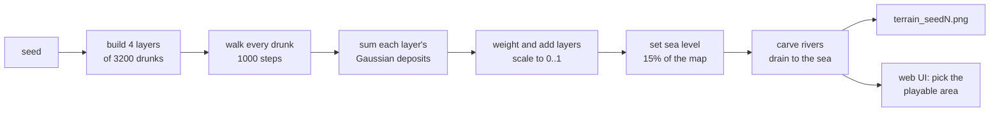
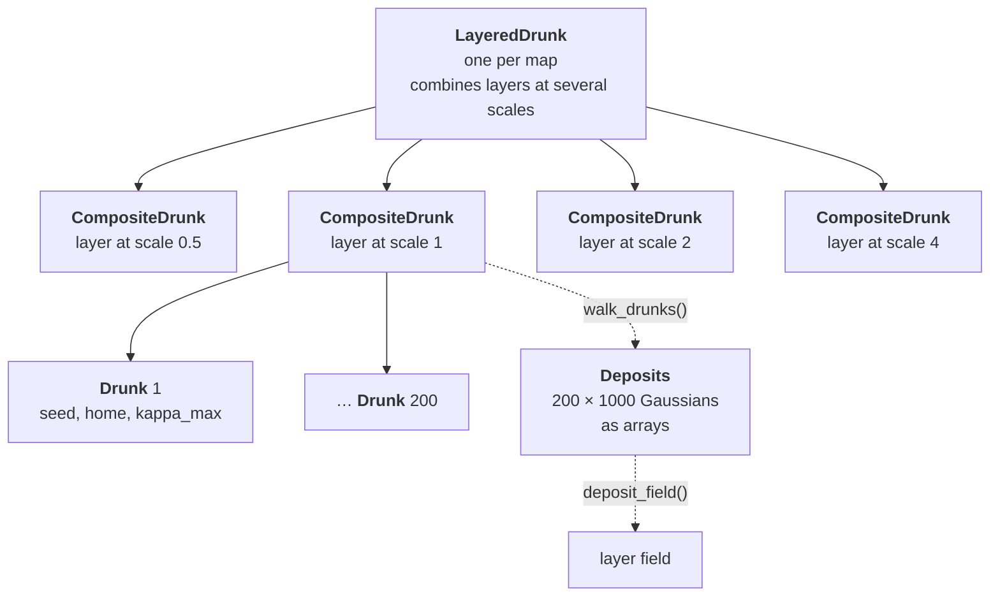
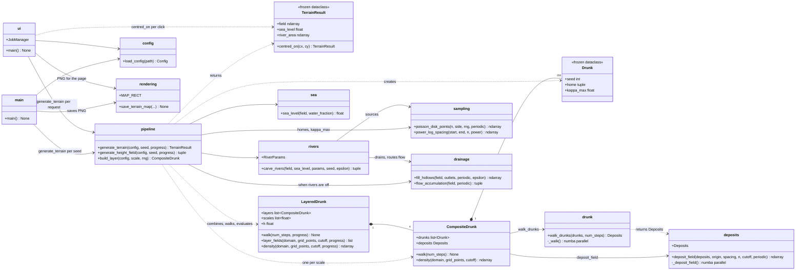

# drunk

## Overview

**drunk** generates realistic, seamlessly tiling terrain height maps from random walkers
("drunks"), as a basis for Cities: Skylines II maps.

Each drunk staggers around its home, leaving a trail of small Gaussian bumps. Hundreds of drunks
at four scales are summed into a multi-scale height field whose statistics match real terrain.
Sea level is then set, hollows are filled so every land cell drains to the sea, and "river
drunks" carve graded valleys down to the coast. Everything heavy runs in compiled, parallel
[numba](https://numba.pydata.org/) code, so a whole 57 km world map (1600 × 1600 cells) takes
about 7 s to generate.

There are two ways to use it: a command-line program that saves maps for the seeds in
`config.yaml`, and a small web UI where you type a seed, press **Generate** and see the map.

| Seed 41 | Seed 42 | Seed 43 |
|---|---|---|
|  |  |  |

Sea is in blues (darker with depth, coastline outlined), land runs from green lowlands to white
peaks, and rivers are light-blue lines that widen downstream. The maps wrap around: the left edge
continues into the right, and the top into the bottom.

Each map is a Cities: Skylines II **world map, 57.344 km** on a side, with the **playable area,
14.336 km** on a side, outlined in white at its centre. In CS2 a heightmap is 4096 × 4096 pixels
covering the playable area (3.5 m per pixel), and the optional world map is another 4096 × 4096
image four times wider (14 m per pixel) whose central 1024 × 1024 pixels are the playable area. In
the web UI you choose where the playable area goes by clicking on the world map. Heights are
normalised (0–1); the web UI labels them in metres.

> **Not yet included:** export to Cities: Skylines II's 4096 × 4096 16-bit heightmap format. The
> current output is a 1600 × 1600 world map (400 × 400 for the playable area) drawn as an annotated
> PNG.

## Quick start

```bash
conda create -n drunk python=3.14
conda activate drunk
pip install -r requirements.txt

python -m app.main      # saves output/terrain_seed41.png, _seed42.png, _seed43.png
python -m app.ui        # opens the web UI at http://localhost:9000
pytest                  # runs the tests (about a second)
```

The first run takes about 10 s longer while numba compiles its kernels. The compiled code is
cached in `app/__pycache__/`, so later runs start straight away.

## Requirements

- Python 3.14
- A conda environment named `drunk`
- Git LFS, for the images in `sample_images/` (see `.gitattributes`)
- Pinned pip libraries: see [`requirements.txt`](requirements.txt) (numba, numpy, matplotlib,
  PyYAML and Pillow for the app; pytest for the tests; tifffile and imagecodecs for the
  real-terrain experiments)

## Setup

```bash
conda create -n drunk python=3.14
conda activate drunk
pip install -r requirements.txt
git lfs install          # once per machine (needs the git-lfs package)
git lfs pull             # fetch the sample images
```

Optional: the experiments in `util/` compare generated maps with real terrain. They need
reference elevation tiles from the free
[Copernicus GLO-30 DEM](https://registry.opendata.aws/copernicus-dem/) in `data/dem/`
(git-ignored, about 230 MB):

```bash
mkdir -p data/dem && cd data/dem
for t in N46_00_E008_00 N39_00_W107_00 N37_00_W082_00 N57_00_W005_00 N50_00_E009_00 N42_00_E000_00; do
  f=Copernicus_DSM_COG_10_${t}_DEM
  curl -sO https://copernicus-dem-30m.s3.amazonaws.com/$f/$f.tif
done
```

## How to run

Run everything from the project root with the `drunk` environment active.

### Generate maps from the command line

```bash
python -m app.main                          # one map per seed in config.yaml
python -m app.main --config my_config.yaml  # use another config file
```

To make different maps, edit `seeds` in [`config.yaml`](config.yaml). Every other setting is
there too (see [Configuration](#configuration)). Maps are saved as
`output/terrain_seed<seed>.png`; the `output/` folder is git-ignored. Three maps take about 25 s
on a 16-core machine (about 7 s each to generate, plus drawing). Example console output:

```
seed 41: LayeredDrunk(layers=4, scales=[0.5, 1.0, 2.0, 4.0], h=0.5, steps=1000)
  scale=0.5: 3200 drunks, step_size=0.5, r0=5, variance=0.25, kappa_max 0.01-0.4
  scale=1: 3200 drunks, step_size=1, r0=10, variance=1, kappa_max 0.01-0.4
  scale=2: 3200 drunks, step_size=2, r0=20, variance=4, kappa_max 0.01-0.4
  scale=4: 3200 drunks, step_size=4, r0=40, variance=16, kappa_max 0.01-0.4
  sea level 0.394
  rivers: 1221 carved (716 reach the sea, 505 are tributaries); every land cell drains to the sea
Saved /home/michael/drunk/output/terrain_seed41.png
seed 42: ...
seed 43: ...

Done. For the interactive web UI, run `python -m app.ui` and visit http://localhost:9000/
```

### Use the web UI

```bash
python -m app.ui
```

The server prints its address and opens it in your browser (under WSL, in the Windows default
browser). Then:

1. Type a **seed** (any whole number from 0 up) and set the **Sea** slider (the share of the map
   that is sea).
2. Press **Generate**. A progress bar follows the stages, and the world map appears in about 8 s,
   with the playable area outlined in white at its centre.
3. **Pick the playable area:** move the mouse over the map and a dashed square shows where the
   playable area would go; click to put it there. The world wraps around, so the map is re-centred
   on your point: the playable area always stays in the middle and the world moves around it. Click
   again as often as you like; the status line gives the playable area's centre in km of the
   generated world.
4. Move the **Peak height** slider to choose how many metres the highest point represents. This
   only relabels the colour bar and summary in metres; the map itself doesn't change.

Moving the Sea slider after a map is drawn has no effect until you press Generate again, because
sea level decides where the rivers run. Stop the server with Ctrl+C.

### Run the tests

```bash
pytest           # all tests, about a second once numba has compiled
pytest -v        # one line per test
```

See [Testing](#testing) for what is covered.

### Redraw the README figures

```bash
python -m app.main && cp output/terrain_seed4[123].png sample_images/   # the three maps above
python util/readme_figures.py                                          # the explanatory figures below
```

## How it works

A map is built in two phases: first a raw height field from drunks, then post-processing into
sea, drained land and rivers.



### 1. A drunk's walk

Each drunk starts at its **home** and takes `walk.num_steps` steps of length `step_size`. Step
directions are drawn from a [von Mises distribution](https://en.wikipedia.org/wiki/Von_Mises_distribution)
(a normal distribution on a circle) centred on the bearing back home. How strongly it pulls
depends on the distance `r` from home:

```
κ(r) = kappa_max · (1 − exp(−r / r0))
```

At home `κ = 0`, so steps go in any direction. Further away the pull rises towards `kappa_max`.
With a small `kappa_max` the drunk wanders far; with a large one it stays close and builds a
compact peak:


After every step the drunk leaves a **Gaussian deposit** (an elliptical bump) at its new position:

- **Orientation:** a random angle in [0, π).
- **Shape:** variance `variance` along the long axis and `variance × u` along the short axis, with
  `u` uniform in (0, 1], so each bump has a random elongation.
- **Amplitude:** the peak height. The k-th deposit has amplitude `initial_amplitude × decay^k`
  (1.0, 0.999, 0.998, …), so after 1000 steps it is about 0.37.

A drunk's height field is the sum of its deposits.

### 2. Many drunks in a layer

A **layer** (`CompositeDrunk`) holds 3200 drunks over the world map, 200 per playable area. Within
a layer they differ only in:

- **Seed:** each drunk's walk depends only on its own seed.
- **Home:** homes are spread evenly but irregularly over the map by Poisson-disk sampling
  (`app/sampling.py`): no two are closer than a minimum spacing, chosen automatically (about 4.8
  units for 3200 drunks in the 384 × 384 world). Spacing is measured across the map's edges, since the
  map wraps around.
- **`kappa_max`:** spread from 0.01 to 0.4 with power-log spacing. Member `i` of `n` gets
  `kappa_max_start · (kappa_max_end / kappa_max_start) ^ (t ^ p)`, with `t = i / (n − 1)` and
  `p = composite.kappa_max_power`. With `p = 4` most drunks are weakly biased and wander widely,
  while a few strongly biased ones form compact peaks:

| Spacing (20 drunks) | Median `kappa_max` | Drunks < 0.02 | Drunks < 0.05 | Drunks < 0.1 |
|---|---|---|---|---|
| Linear (for comparison) | 0.205 | 1 | 2 | 5 |
| Logarithmic (`p = 1`) | 0.064 | 4 | 9 | 12 |
| Power-log, `p = 2` | 0.025 | 9 | 13 | 16 |
| **Power-log, `p = 4` (default)** | **0.013** | **13** | **16** | **17** |

### 3. Layers at four scales

One layer alone has relief at only one size. A **`LayeredDrunk`** stacks layers at scales
`s` = 0.5, 1, 2 and 4. A layer at scale `s` multiplies the step size and `r0` by `s` and the
deposit variance by `s²`. Everything else is the same, so each layer is a statistically exact
`s`-times enlargement of the same terrain. The layers are combined as

```
height = Σ_j (s_j / s_min)^h · L_j / std(L_j)        then scaled linearly to [0, 1]
```

Each layer is first scaled to unit standard deviation, so the weights `(s / s_min)^h` alone set
how much relief each scale adds. Larger scales get more weight, so height differences grow with
distance as `distance^h`, as in natural terrain (`h = 0.5`). A layer at scale `s` is smoother, so
it is evaluated on a grid `s / s_min` times coarser and resampled, which keeps every layer
equally cheap.


**Why it looks like real terrain.** `util/terrain_experiment.py` compared generated maps with 48
crops of real terrain, 14.3 km across, from six mountain and upland regions:

| | Spectral slope β | Roughness H | Hypsometric integral | Skewness |
|---|---|---|---|---|
| Real terrain | 3.85 ± 0.45 | 0.57 ± 0.12 | 0.43 ± 0.09 | +0.12 ± 0.42 |
| Single layer (old design) | 4.28 | 0.47 | 0.08 | +2.37 |
| Four layers (default) | 3.84 | 0.50 | 0.46 | +0.06 |

These figures come from the original pure-Python implementation. After the numba rewrite, the
same statistics over seeds 1–8 (without sea or rivers) are unchanged within noise:

| Seeds 1–8 (mean) | β | H | Hypsometric integral | Skewness | Sea level (15%) |
|---|---|---|---|---|---|
| Pure Python (before) | 3.81 | 0.51 | 0.45 | +0.22 | 0.284 |
| numba (now) | 3.85 | 0.50 | 0.44 | +0.18 | 0.275 |

### 4. The map wraps around

The world map is a 384 × 384 square of walk units (drawn as 57.344 km) treated as a torus. Drunks
walk freely, but each deposit is drawn at its position modulo the map size, so a bump crossing the
right edge continues from the left edge, and likewise top and bottom. This has four benefits:

- **No thinning at the edges.** On a cut-out map, cells near an edge would miss the deposits of
  drunks beyond it, giving every map a slight dome.
- **No wasted work.** Every deposit lands on the map.
- **Seamless tiling.** Opposite edges match.
- **Any point can be the centre.** Rolling the map round changes only where its edges fall, so
  the playable area can be put anywhere (see below).

**World map and playable area.** The terrain was tuned so that 96 walk units look like a real
14.3 km area: one CS2 playable area. The world map is four times wider, 384 units (57.344 km),
with 16 times as many drunks (3200 per layer) and river sources (1600), so every playable-sized
window of it has the same terrain statistics. The grid is 1600 × 1600, so the playable area at the
centre is exactly 400 × 400 cells. Drunks don't need to reach the edges for this to work: homes are
spread over the whole world, each drunk builds terrain only within about 100 units of its home,
and there are no edges anyway.

In the web UI, clicking a point on the world map makes it the centre of the playable area
(`TerrainResult.centred_on`): the map is rolled round so that point is in the middle, where the
playable square is always drawn.

### 5. Sea, drainage and rivers


1. **Sea level** (`app/sea.py`) is set so that `sea.water_fraction` (15%) of the map lies below
   it. Every map then gets the same share of sea, whatever its heights. For the three sample maps
   it is 0.269 to 0.394. Heights are not changed. Everything below sea level counts as sea,
   including landlocked basins, so the sea is a scatter of basins rather than one ocean.
2. **Draining** (`app/drainage.py`) fills hollows. About 11% of the raw terrain's land sits in
   closed depressions (real terrain: about 1.5%), where water would pool instead of reaching the
   sea, as Cities: Skylines II's water simulation needs. A priority-flood fill (Barnes et al.,
   2014) raises each hollow to its spill level plus a tiny gradient (`drainage.epsilon`), so every
   land cell then has a downhill path to the sea. Filled hollows become flat patches (red above).
3. **River carving** (`app/rivers.py`):
   - **Sources:** `rivers.sources` points are Poisson-disk sampled; those in the sea or less than
     `min_source_height` above it are dropped. The highest sources go first, so long trunk rivers
     come before their tributaries.
   - **Walk:** each river drunk steps one cell at a time. Its direction is a von Mises draw around
     a blend of its previous heading (`inertia`) and the smoothed downstream direction, so it
     meanders but follows the valleys. It stops at the sea or when it meets an earlier river,
     becoming a tributary. If it makes no progress for `stall_steps` steps, it switches to
     steepest descent.
   - **Carve:** the riverbed descends from the source to the mouth with a graded profile,
     `bed slope ∝ catchment area^−concavity`, the relation measured on real rivers. Terrain
     around it is lowered towards the bed with a Gaussian cross-section of width
     `valley_width · √(catchment area)` cells, forming the valley.
   - The map is drained again afterwards.

River carving brings channel concavity (θ in `slope ∝ area^−θ`) from 0.10 to real terrain's
0.33. The defaults were tuned with `util/river_experiment.py` against the same real-terrain crops:

| | β | H | HI | Skewness | Concavity θ | Distance |
|---|---|---|---|---|---|---|
| Real terrain | 3.91 ± 0.55 | 0.56 ± 0.15 | 0.43 ± 0.09 | +0.15 ± 0.50 | 0.33 ± 0.07 | 0 |
| Drained only | 3.82 | 0.51 | 0.47 | +0.04 | 0.10 | 1.64 |
| Rivers, 200 sources, `kappa` 4, valley 0.05 | 3.75 | 0.50 | 0.46 | +0.09 | 0.28 | 0.45 |
| **Rivers, 100 sources, `kappa` 16, valley 0.03 (default)** | 3.74 | 0.50 | 0.47 | +0.07 | **0.33** | **0.32** |

("Distance" is the RMS z-score against real terrain over all five statistics; 0 is a perfect
match.) The river colour only marks where rivers run: channels are cut by about 1–2% of the
relief, not down to sea level. **Known artefact:** where a river falls back to steepest descent
across a filled flat, its path can run in a straight line.

If the sea fraction is 0, a wrap-around map has nowhere to drain to, so draining and rivers are
skipped.

### 6. Speed and reproducibility

All heavy work is compiled with numba and runs in parallel on every core (`parallel.threads`):

| Stage | Where | Time (1600 × 1600 world map, 16 cores) |
|---|---|---|
| Sample 12 800 homes (Poisson disk) | `app/sampling.py` `_bridson` | ~0.2 s |
| Walk 12 800 drunks × 1000 steps | `app/drunk.py` `_walk` | ~0.3 s |
| Sum 12.8 million Gaussian deposits | `app/deposits.py` `_deposit_field` | ~3.1 s |
| Fill hollows, carve 1200 rivers | `app/drainage.py`, `app/rivers.py` | ~3.3 s |
| Draw the PNG | `app/rendering.py` (matplotlib) | ~0.5 s |

That is about 7 s to generate a world map, and 0.5 s to draw it (or redraw it re-centred in the
UI). Peak memory is about 1.2 GB. For comparison, the earlier pure-Python version took about 20 s
for a single 14 km map, a sixteenth of the area.

A map depends only on its seed and the config, never on the number of threads:

- **Walking:** drunks are walked in parallel, but each one reseeds its thread's random generator
  with its own seed before drawing all its numbers, so its walk is the same whichever thread runs
  it.
- **Deposits:** each deposit is only evaluated inside the box where it exceeds `plot.cutoff`
  (1/4096) of its peak, about 4.08 standard deviations; along each grid row, only the cells
  inside that ellipse are visited, with values from a two-multiplication recurrence instead of an
  `exp` per cell. Deposits are bucketed by the first grid row they touch, and rows are filled in
  parallel, each looking back only as far as a deposit can reach. Each row is written by one
  thread, adding its deposits in a fixed order, so the sum is bit-for-bit the same on any number
  of threads.

## Configuration

All settings live in [`config.yaml`](config.yaml) at the project root, which has a comment on
every setting. `app/config.py` (`load_config()`) reads it into a typed, read-only `Config` object.
Every setting is required, so a missing one fails at startup with its name. Relative paths are
resolved against the folder containing the config file.

| Setting | Type | Default | Description |
|---|---|---|---|
| `seeds` | list of int | `[41, 42, 43]` | `app.main` makes one map per seed |
| `layers.scales` | list of float | `[0.5, 1.0, 2.0, 4.0]` | One layer per scale `s`: step size and `r0` × `s`, deposit variance × `s²` |
| `layers.h` | float | `0.5` | Layer weighting exponent: layer `j` is weighted `(s_j / s_min)^h` after scaling to unit standard deviation |
| `composite.drunks` | int | `3200` | Drunks in each layer: 200 per playable area (96 × 96 units), the density the terrain was tuned at; scale with `plot.domain`'s area |
| `composite.kappa_max_start` | float | `0.01` | `kappa_max` of the first drunk in each layer (> 0) |
| `composite.kappa_max_end` | float | `0.4` | `kappa_max` of the last drunk (> 0) |
| `composite.kappa_max_power` | float | `4.0` | Power-log spacing exponent: `1` = logarithmic, `> 1` = more drunks near `kappa_max_start` |
| `parallel.threads` | int or `null` | `null` | Threads for the numba kernels (`null` = every core); results are identical whatever the number |
| `walk.num_steps` | int | `1000` | Steps each drunk takes |
| `walk.step_size` | float | `1.0` | Step length, at scale 1 |
| `walk.r0` | float | `10.0` | Distance over which the homeward pull builds up (`κ` ≈ 63% of `kappa_max` at `r = r0`), at scale 1 |
| `deposit.variance` | float | `1.0` | Long-axis variance of each deposit, at scale 1 (short axis = `variance × u`, `u` ~ U(0, 1]) |
| `deposit.initial_amplitude` | float | `1.0` | Peak height of the first deposit |
| `deposit.decay` | float | `0.999` | The k-th deposit has amplitude `initial_amplitude × decay^k` |
| `plot.domain` | float | `384.0` | Side of the square, wrap-around world map, centred on the origin, in walk units (drawn as `cs2.world_width_km`); 96 units is one playable area |
| `plot.grid_points` | int | `1600` | Grid points per side of the height field (400 per playable area) |
| `plot.cutoff` | float | `0.000244140625` (1/4096) | Each deposit is evaluated only where it exceeds `cutoff` × its peak (≈ 4.08 standard deviations); must be in (0, 1) |
| `sea.water_fraction` | float | `0.15` | Share of each map that is sea (also the UI slider's default); in [0, 1), `0` = no sea, so no draining or rivers |
| `drainage.fill` | bool | `true` | Fill hollows when rivers are off (river carving always drains) |
| `drainage.epsilon` | float | `0.000001` | Gradient left across filled hollows, in normalised height per cell |
| `rivers.enabled` | bool | `true` | Carve rivers after setting sea level |
| `rivers.sources` | int | `1600` | River sources over the world, 100 per playable area, Poisson-disk sampled (those in or near the sea are dropped) |
| `rivers.min_source_height` | float | `0.05` | Minimum source height above sea level, as a fraction of the land's height range |
| `rivers.direction_smoothing` | float | `2.0` | Gaussian smoothing (cells) of the downstream-direction field |
| `rivers.kappa` | float | `16.0` | von Mises concentration around the downstream direction (lower = more meandering) |
| `rivers.inertia` | float | `0.5` | Share of the previous heading kept each step |
| `rivers.concavity` | float | `0.45` | Graded riverbed: bed slope ∝ catchment area^−concavity |
| `rivers.valley_width` | float | `0.03` | Valley half-width (Gaussian sigma, cells) = `valley_width × √(catchment cells)` |
| `rivers.min_valley_sigma` | float | `1.0` | Narrowest valley sigma, in cells |
| `rivers.stall_steps` | int | `50` | Steps without progress towards the sea before switching to steepest descent |
| `cs2.max_height_m` | float | `4096.0` | Height spanned by a CS2 16-bit heightmap at the editor's default scale; the UI's peak-height maximum |
| `cs2.world_width_km` | float | `57.344` | Side of the CS2 world map; the whole generated map is drawn this wide, with axes in km |
| `cs2.playable_width_km` | float | `14.336` | Side of the CS2 playable area (what a heightmap covers), outlined at the centre of the world map |
| `ui.host` / `ui.port` | str / int | `127.0.0.1` / `9000` | Address the web UI serves on |
| `ui.open_browser` | bool | `true` | Open the page in the browser when the UI starts |
| `ui.peak_height_m` | float | `1000.0` | Default peak-height slider value: height 1.0 is labelled as this many metres |
| `ui.peak_height_min_m` / `ui.peak_height_step_m` | float | `100.0` / `10.0` | Peak-height slider minimum and step, in metres |
| `ui.sea_fraction_max` | float | `0.95` | Sea slider maximum (fraction of the map) |
| `paths.output_dir` | path | `output` | Folder where `app.main` writes maps (git-ignored) |

Lengths in `rivers` are in grid cells, so they depend on `plot.grid_points`.

## Programs and command-line parameters

### `app.main`: generate maps

For each seed in `seeds`, runs the full pipeline (`app.pipeline.generate_terrain`), prints a
summary and saves the map (sea, land, rivers, coastline, and sea level marked on the colour bar)
to `<paths.output_dir>/terrain_seed<seed>.png`.

| Parameter | Type | Required | Default | Description |
|---|---|---|---|---|
| `--config` | path | optional | `config.yaml` (project root) | YAML config file to load |

```bash
python -m app.main                          # or: python app/main.py
python -m app.main --config my_config.yaml
```

### `app.ui`: web UI

Serves a single page with a seed field, **Generate** button, peak-height and sea sliders,
progress bar and the map. It uses Python's standard-library HTTP server, with no extra
dependencies. Maps are generated one at a time in a background thread (a second request while one
is running is refused). Heights stay normalised (0–1) internally; the peak-height slider only
labels them in metres, from `ui.peak_height_min_m` up to `cs2.max_height_m`.

| Parameter | Type | Required | Default | Description |
|---|---|---|---|---|
| `--config` | path | optional | `config.yaml` (project root) | YAML config file; `ui.host`, `ui.port` and `ui.open_browser` set up the server |

```bash
python -m app.ui                            # or: python app/ui.py
python -m app.ui --config my_config.yaml
```

Endpoints (for scripting):

| Method and path | Description |
|---|---|
| `GET /` | The page |
| `POST /api/generate` with `{"seed": <int>, "sea_percent": <number>}` | Start a job (`sea_percent` optional, 0 to `ui.sea_fraction_max` × 100); returns `{"job": <id>}`, 409 if one is running, 400 for a bad seed or sea percentage |
| `GET /api/progress/<id>` | `{"fraction", "message", "done", "error", "info"}`; when done, `info` gives the sea level, highest point, sea fraction, river counts and `grid_points` |
| `GET /api/image/<id>?peak=<m>&cx=<col>&cy=<row>` | The finished world map as PNG, labelled with height 1.0 = `<m>` metres, rolled so grid cell (`cx`, `cy`) is at the centre inside the outlined playable area (default: the middle cell; 400 if outside the grid) |

### `util/readme_figures.py`: README figures

Draws `drunk_walks.png`, `layers.png` and `stages.png` (seed 41) from `config.yaml`. The layer and
stage figures show the central playable area, since the whole world is too busy to read.

| Parameter | Type | Required | Default | Description |
|---|---|---|---|---|
| `--config` | path | optional | `config.yaml` | App config file |
| `--out` | path | optional | `sample_images/` | Output folder |

```bash
python util/readme_figures.py
python util/readme_figures.py --out output/figures
```

### `util/terrain_experiment.py`: compare generation settings with real terrain

Needs the Copernicus tiles (see [Setup](#setup)). For each configuration in an experiment YAML it
generates `samples` maps and computes four scale-free statistics (`util/terrain_stats.py`):

- **Spectral slope β:** `P(k) ∝ k^−β`, from the radially averaged power spectrum.
- **Roughness H:** RMS height difference ∝ distance^H.
- **Hypsometric integral:** mean height as a fraction of the min-to-max range.
- **Skewness** of the height distribution.

It compares them with 14.3 km square crops (a CS2 playable area) of the real tiles
(`util/reference_terrain.py`) and ranks configurations by RMS z-score. Results go to
`output/experiments/<name>_summary.txt`, `<name>_maps.csv` and `<name>_contact_sheet.png`.

| Parameter | Type | Required | Default | Description |
|---|---|---|---|---|
| `--config` | path | optional | `util/terrain_experiment.yaml` | Experiment YAML file |

```bash
python util/terrain_experiment.py                                          # phase 1
python util/terrain_experiment.py --config util/terrain_experiment_phase6.yaml
```

Each experiment YAML (`terrain_experiment.yaml` and `_phase2` to `_phase6`) has a `name` (output
prefix), `seed`, `samples`, `reference` (tile folder, crop size, crops per tile), `map` (domain,
grid points, cutoff), a `baseline` set of parameters and `configs` that override some of them. The
options are documented in the YAML comments. Unlike the app, this tool draws maps on a cut-out
(non-wrapping) grid and supports experiment-only options: Lévy-flight or mixed homes, and
amplitude and variance scaling by spread.


### `util/river_experiment.py`: tune river carving

Needs the Copernicus tiles. Generates one raw map per seed from `config.yaml` (cached in
`output/experiments/map_cache/`), applies each variant (drain only, or rivers with overridden
parameters), computes the four statistics above (on the central playable area, the size of the
real-terrain crops) plus channel concavity (over the whole world, which needs whole catchments),
and ranks variants against real terrain. Results go to `output/experiments/`.

| Parameter | Type | Required | Default | Description |
|---|---|---|---|---|
| `--config` | path | optional | `util/river_experiment.yaml` | Experiment YAML file |
| `--app-config` | path | optional | `config.yaml` | App config for generation settings and default river parameters |

```bash
python util/river_experiment.py                                          # round 1
python util/river_experiment.py --config util/river_experiment_round2.yaml
```

Each experiment YAML has a `name`, `seeds`, `reference`, a `baseline` (`rivers`: carve or drain
only; `river_params`: overrides of `config.yaml`'s `rivers` settings) and `configs` overriding the
baseline. Delete `output/experiments/map_cache/` after changing the generation code, since the
cache key covers settings, not code.

### Library API

The pipeline can also be driven from Python:

```python
from app.config import load_config
from app.pipeline import generate_terrain

config = load_config()
result = generate_terrain(config, seed=7)
result.field        # 1600 x 1600 heights in [0, 1], drained, rivers carved
moved = result.centred_on(300, 1450)   # the world rolled so cell (column 300, row 1450) is central
result.sea_level    # heights below this are sea
result.river_area   # catchment area of each river cell (0 elsewhere)
```

| Name | Module | Description |
|---|---|---|
| `generate_terrain(config, seed, progress=None)` | `app.pipeline` | The whole pipeline; returns a `TerrainResult` (field, sea level, rivers, state); `.centred_on(cx, cy)` rolls it so a cell is at the centre |
| `playable_crop(config, field)` | `app.pipeline` | The central playable area of a world-map field (400 × 400 of 1600 × 1600) |
| `generate_height_field(config, seed, progress=None)` | `app.pipeline` | Only the raw height field: returns `(LayeredDrunk, field)` |
| `build_layer(config, scale, rng)` | `app.pipeline` | One layer's `CompositeDrunk` at `scale` |
| `Drunk(seed, step_size, kappa_max, r0, variance, decay, initial_amplitude, home)` | `app.drunk` | A drunk's parameters (frozen dataclass); `seed` must be in [0, 2³²) |
| `walk_drunks(drunks, num_steps)` | `app.drunk` | Walk drunks in parallel; returns their `Deposits`, drunk by drunk |
| `Deposits(x, y, angle, var_major, var_minor, amplitude)` | `app.deposits` | Deposits as parallel arrays |
| `deposit_field(deposits, origin, spacing, n, cutoff, periodic)` | `app.deposits` | Sum deposits on an `n` × `n` grid, wrapping around if `periodic` |
| `CompositeDrunk(drunks)` | `app.composite_drunk` | A layer: `.walk(num_steps)`, then `.density(domain, grid_points, cutoff)` |
| `LayeredDrunk(layers, scales, h)` | `app.layered_drunk` | Layers combined: `.walk(num_steps)`, `.layer_fields(...)`, `.density(domain, grid_points, cutoff)` |
| `sea_level(field, water_fraction)` | `app.sea` | Height below which `water_fraction` of the field lies |
| `fill_hollows(field, outlets, periodic, epsilon)` | `app.drainage` | Priority-flood fill so every cell drains to an outlet |
| `flow_accumulation(field, periodic)` | `app.drainage` | D8 flow routing: catchment area and downhill slope of every cell |
| `carve_rivers(field, sea_level, params, seed, epsilon)` | `app.rivers` | Walk and carve river drunks; returns `(field, river_area, carved, reaching_sea)` |
| `save_terrain_map(filename, field, title, sea_level, width_km, rivers, height_scale_m, playable_km, dpi)` | `app.rendering` | Draw a terrain map PNG, `width_km` across with axes in km, heights optionally in metres, the playable area (`playable_km` across) outlined at the centre; the map sits at `MAP_RECT` in the figure |

## Testing

```bash
pytest
```

The tests (`tests/`) use small maps and run in about a second:

| File | What it checks |
|---|---|
| `test_deposits.py` | The deposit sum matches exact evaluation to within the cutoff, also on a wrap-around grid with bumps wider than the map; on a wrap-around grid, shifting deposits by a period changes nothing and shifting by whole cells rolls the field; results are bit-for-bit identical on 1 or many threads; bad cutoffs are refused |
| `test_drunk.py` | A walk depends only on its own seed; steps have the right length; deposit shapes and amplitudes are as configured; homeward bias keeps drunks closer to home; out-of-range seeds are refused |
| `test_terrain.py` | Resampling, Poisson-disk spacing, power-log spacing, sea fraction; hollow filling only raises cells and makes every cell drain (wrap-around and cut-out grids); river carving drains and is reproducible; the whole pipeline is reproducible, in [0, 1], has the requested sea and drains; re-centring moves the chosen cell to the centre and keeps every height and river |
| `test_config.py` | The shipped config loads; a missing setting is named in the error; out-of-range values are refused |
| `test_rendering.py` | A terrain map is saved as a PNG spanning 0 to the world width on both axes, labelled in km, with the map exactly at `MAP_RECT` (which the UI relies on to turn clicks into map positions) and the playable area outlined at the centre |

"Drains" is checked strictly: every land cell must have a strictly lower neighbour, so following
the way down can only end at the sea.

## System diagram

How the map is built, from the classes that hold the drunks to the modules that post-process the
height field:



Modules and their main members:



## Project layout

```
drunk/
├── app/                     # The application
│   ├── main.py              # Command line: generate the configured seeds and save their maps
│   ├── ui.py                # Web UI at localhost:9000
│   ├── pipeline.py          # The generation pipeline shared by main and ui
│   ├── config.py            # Loads config.yaml into typed, read-only dataclasses
│   ├── drunk.py             # Drunk parameters and the parallel walk (numba)
│   ├── deposits.py          # Gaussian deposits and their parallel sum on a grid (numba)
│   ├── composite_drunk.py   # CompositeDrunk: one layer of drunks
│   ├── layered_drunk.py     # LayeredDrunk: layers at several scales, combined
│   ├── sampling.py          # Poisson-disk homes and power-log kappa_max spacing
│   ├── sea.py               # Sea level from the share of the map that is sea
│   ├── drainage.py          # Hollow filling and D8 flow routing (numba)
│   ├── rivers.py            # River drunks: walk the drainage, carve graded valleys (numba)
│   └── rendering.py         # Terrain-map PNGs (axes in km, heights optionally in m)
├── tests/                   # pytest suite
├── util/                    # Standalone tools
│   ├── readme_figures.py            # Draws the README's explanatory figures
│   ├── terrain_experiment.py        # Compares generation settings with real terrain
│   ├── terrain_experiment*.yaml     # Its experiment definitions (phases 1-6)
│   ├── river_experiment.py          # Tunes river carving against real terrain
│   ├── river_experiment*.yaml       # Its experiment definitions (rounds 1-2)
│   ├── terrain_stats.py             # Scale-free terrain and drainage statistics
│   └── reference_terrain.py         # Square crops from Copernicus DEM tiles
├── sample_images/           # Images shown in this README
├── data/dem/                # Reference elevation tiles (git-ignored; see Setup)
├── output/                  # Generated maps and experiment results (git-ignored)
├── config.yaml              # All settings
├── pytest.ini               # Test settings
├── requirements.txt         # Pinned pip dependencies
├── .gitignore
└── .gitattributes           # Line endings and Git LFS tracking
```
