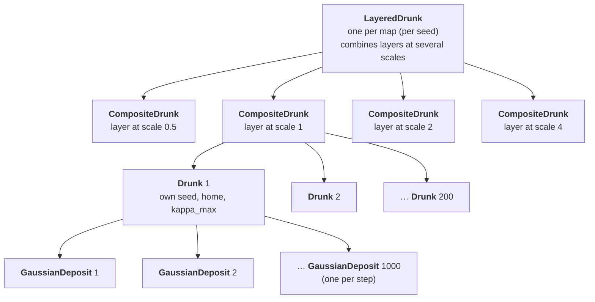
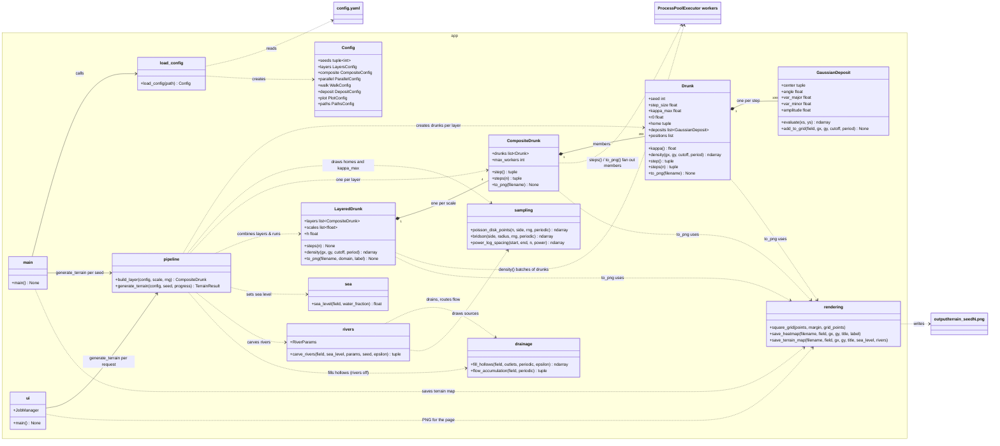
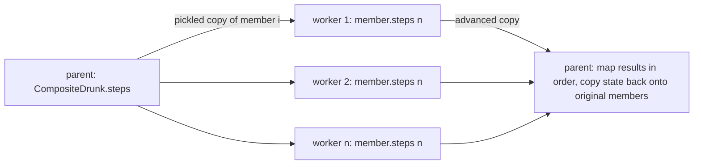
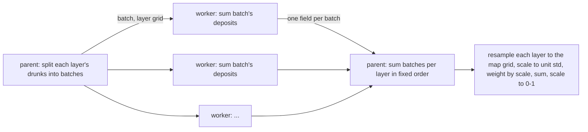

# drunk

## Overview

A simple 2D random-walk ("drunkard's walk") simulator. Each `Drunk` starts at its own home position
and, on every step, staggers a fixed distance in a random direction that is biased back towards
home, and
deposits a randomly oriented 2D Gaussian at its new location. A `CompositeDrunk` groups several
already-constructed drunks, runs them in parallel worker processes, and renders the sum of all their
deposits. A `LayeredDrunk` stacks composites at several scales into one multi-scale height field,
whose statistics match real terrain (see [Layered terrain](#layered-terrain)); it is intended as
the basis for Cities: Skylines II height maps.

The program builds three layered maps, one for each of seeds 41, 42 and 43. Each has four layers at
scales 0.5, 1, 2 and 4, each a composite of 200 drunks. Within a layer the drunks are identical
except for a random seed, a home position (Poisson-disk sampled inside the 96 × 96 map; see
[Start positions](#start-positions)), and a homeward bias `kappa_max` spread from 0.01 to 0.4 with
power-log spacing that puts most drunks at the weakly biased end (see
[`kappa_max` spacing](#kappa_max-spacing)). The map **wraps around** at its edges (see
[Wrap-around map](#wrap-around-map)). Sea level is then set so that 15% of each map is sea (see
[Sea level](#sea-level)). River drunks then carve graded river valleys down to the sea, and every
land cell is made to drain to the sea (see [River carving](#river-carving) and
[Drainage](#drainage)). For each map it prints a summary and saves the height field, scaled to
[0, 1], as a terrain-map PNG with sea, land and rivers.

### Sample output

| Seed 41 | Seed 42 | Seed 43 |
|---|---|---|
|  |  |  |

Each map has relief at every scale, from small bumps on the finest layer to the broad highlands
and basins of the coarsest, and fills the whole square evenly up to the edges. Sea level is set so
15% of the map is sea (blues, darker with depth, coastline outlined). Filled hollows appear as
flat patches of land, where lakes would otherwise sit.

Sample images are kept in [`sample_images/`](sample_images/) (generated with the `config.yaml`
values listed under [Configuration](#configuration)).

## System design

A map is built from four nested levels. Each level is a container of the one below, and each one's
height field is built from its members' fields:



(Only one layer's drunks and one drunk's deposits are drawn; every layer has 200 drunks and every
drunk has one deposit per step.)

| Level | Class (file) | Contains | Per map (defaults) | Its height field |
|---|---|---|---|---|
| Map | `LayeredDrunk` (`app/layered_drunk.py`) | one `CompositeDrunk` per scale in `layers.scales` | 1 | Σ over layers of `(s / s_min)^h · layer / std(layer)`, scaled to [0, 1] |
| Layer | `CompositeDrunk` (`app/composite_drunk.py`) | `composite.drunks` `Drunk`s, all at the layer's scale | 4 | sum of its drunks' fields |
| Walker | `Drunk` (`app/drunk.py`) | one `GaussianDeposit` per step taken | 800 (4 × 200) | sum of its deposits |
| Blob | `GaussianDeposit` (`app/gaussian.py`) | — | 800 000 (800 × 1000) | one oriented Gaussian bump |

**What varies where:**

- **Between layers:** only the scale `s`. A layer's drunks have step size `walk.step_size × s`,
  `r0` of `walk.r0 × s` and deposit variance `deposit.variance × s²`. Everything else is
  identical, so each layer is a statistically exact `s`-times enlargement of the same terrain
  ([Layered terrain](#layered-terrain)).
- **Between drunks in a layer:** only the random seed, the home (start position, Poisson-disk
  sampled; [Start positions](#start-positions)) and `kappa_max`, which is power-log spaced from
  0.01 to 0.4 ([`kappa_max` spacing](#kappa_max-spacing)). The same 200 `kappa_max` values are used
  in every layer.
- **Between deposits of a drunk:** position (wherever the drunk stepped), random orientation and
  elongation, and an amplitude that decays geometrically with each step
  ([Gaussian deposits](#gaussian-deposits)).

**Containers don't build their members.** `CompositeDrunk` and `LayeredDrunk` receive
already-created objects. `app/pipeline.py` (`generate_terrain`, used by both `main.py` and the web UI) builds everything:

```mermaid
flowchart LR
    S["seed (from config.seeds)"] --> R[RNG]
    R --> B["build_layer(config, s, rng)<br/>for each scale s"]
    B -->|"200 seeds, Poisson-disk homes,<br/>power-log kappa_max,<br/>step/r0/variance scaled by s"| D["200 Drunk objects"]
    D --> C["CompositeDrunk(drunks)<br/>one layer"]
    C -->|"4 layers, one per scale"| L["LayeredDrunk(layers, scales, h)"]
    L --> W["steps(num_steps)<br/>each layer's drunks walk in parallel"]
    W --> F["density(grid, period=domain): drunks evaluated in parallel batches<br/>→ one field per layer (coarse grid, wrap-around)<br/>→ resample, scale to unit std, weight, sum<br/>→ scale to [0, 1]"]
    F --> SL["post-processing: sea_level(field, water_fraction)<br/>height below which 15% of the map lies"]
    SL --> RV["post-processing: carve_rivers(field, sea_level, params, seed)<br/>drain → river drunks walk down the drainage and carve graded valleys → drain again"]
    RV --> P["save_terrain_map(file, field, sea_level, rivers)"]
    P --> O["output/terrain_seedN.png"]
```



`Drunk` and `CompositeDrunk` can also be used on their own: each has its own `density()` and
`to_png()` for a single walker or a single-scale group (see the
[class reference](#programs-and-command-line-parameters)).

## How it works

The sections below describe each part of the design in detail, from where drunks start, through
how each one walks and deposits, to how drunks are grouped into layers and combined.

### Start positions

Each layer's drunks start at points drawn by Poisson-disk sampling (`app/sampling.py`) inside the
map, a square of side `plot.domain` (96 by default) centred on the origin. The sampling wraps around
like the map: spacing is measured across the edges, and candidate points that leave one edge
re-enter at the opposite one. No two points are closer
than a minimum spacing `r`, so start points are spread evenly across the square but irregularly,
without clumps or a visible grid.

The spacing is chosen automatically from the number of drunks `n` and the square's area `A`:
`r = sqrt(0.65 · A / (1.3 · n))`. Bridson's algorithm yields about `0.65 · A / r²` points, so this
aims for about 1.3 `n`, and then a random subset of exactly `n` is kept. Any subset still respects
the spacing, and unlike Bridson's own first `n` points (which cluster around its starting point)
it covers the whole square. If too few points come out, `r` shrinks by 10% and sampling repeats,
which hasn't been needed in testing. For 200 drunks in a 96 × 96 square, `r` is about 4.8.

### Wrap-around map

The map is treated as a torus: a deposit is drawn at its position modulo the map size, so a blob
crossing the right edge continues from the left edge, and likewise top and bottom
(`GaussianDeposit.add_to_grid` with `period`). Drunks still walk freely; only their deposits are
wrapped.

- **No edge thinning.** With a plain cut-off map, points near an edge miss the mass that drunks
  from beyond it would have deposited. When the map was cut from a larger 128-unit home square,
  the scale-4 layer was about 19% lower in the outer 8 units than in the centre (only 29% of its
  deposits landed on the map), giving every map a slight dome. Wrapped, there is no such falloff.
- **No wasted work.** Every deposit lands on the map.
- **Seamless tiling.** Opposite edges match: the average height jump across a seam (0.0186) is the
  same as between neighbouring pixels anywhere else (0.0177).

The map grid covers `[-domain/2, domain/2)` once, leaving out the far edge, which is the same line
as the near edge; coarse layer grids are resampled with wrap-around interpolation.

### Homeward bias

Each drunk is biased back towards its own **home** (its start position). Step directions are drawn
from a [von Mises distribution](https://en.wikipedia.org/wiki/Von_Mises_distribution) (the
circular analogue of a normal distribution) centred on the bearing back to home,
`atan2(home_y − y, home_x − x)`. Its concentration `κ` depends only on the drunk's distance `r`
from home:

```
κ(r) = kappa_max · (1 − exp(−r / r0))
```

`kappa_max` and `r0` are constants for each drunk (in `main.py`, `r0` comes from `config.yaml` and
`kappa_max` is set per member). At home `κ = 0`, so directions are
uniform. As `r` grows, `κ` rises smoothly towards `kappa_max` and steps increasingly point home.
For example, with `kappa_max = 2`, `r0 = 10` and home at (0, 0):

| Drunk at | r | κ | P(step has homeward component) | P(within ±45° of home) |
|---|---|---|---|---|
| (0, 0) | 0 | 0 | 50% (uniform) | 25% (uniform) |
| (0, 1) | 1 | 0.19 | 56% | 29% |
| (3, 4) | 5 | 0.79 | 73% | 44% |
| (10, 10) | 14.1 | 1.51 | 87% | 59% |

Setting `kappa_max: 0` recovers a plain uniform random walk.

### `kappa_max` spacing

Member `i` of `n` (with `t = i / (n − 1)` running from 0 to 1) gets

```
kappa_max = kappa_max_start · (kappa_max_end / kappa_max_start) ^ (t ^ p)
```

where `p` is `composite.kappa_max_power`. With `p = 1` this is ordinary logarithmic spacing
(`np.geomspace`). `p > 1` crowds more members towards `kappa_max_start`, and `p < 1` towards
`kappa_max_end`. Both ends are always included. For 20 drunks between 0.01 and 0.4:

| Spacing | Median `kappa_max` | Drunks < 0.02 | Drunks < 0.05 | Drunks < 0.1 |
|---|---|---|---|---|
| Linear (for comparison) | 0.205 | 1 | 2 | 5 |
| Logarithmic (`p = 1`) | 0.064 | 4 | 9 | 12 |
| Power-log, `p = 2` | 0.025 | 9 | 13 | 16 |
| Power-log, `p = 3` | 0.016 | 11 | 15 | 17 |
| **Power-log, `p = 4` (current)** | **0.013** | **13** | **16** | **17** |

So most drunks are only weakly biased and wander widely, while a few strongly biased ones form
compact peaks. From `p = 3` the first several members are almost identical (≈ 0.0100), differing
mainly in their seeds and homes; going higher mostly adds more near-duplicates.

### Gaussian deposits

After each step the drunk deposits an unnormalised 2D Gaussian (`app/gaussian.py`,
`GaussianDeposit`) centred on its new location:

- **Orientation:** the principal axes are rotated by an angle drawn uniformly from [0, π).
- **Shape:** variance `variance` along the major axis and `variance × u` along the minor axis,
  with `u` drawn uniformly from (0, 1], so each blob has a random elongation.
- **Amplitude:** the peak height (value at the centre). The k-th deposit (k = 0, 1, …) has
  amplitude `initial_amplitude × decay^k` (1.0, 0.999, 0.998, …), so later deposits are weaker.
  After 1000 steps the amplitude is ≈ 0.37.

The drunk stores these deposits rather than bare locations (its path is the sequence of deposit
centres, starting at its home). `to_png` evaluates their sum on a grid covering the path plus a
3-standard-deviation margin, and renders it as a heatmap.

**Cutoff.** A Gaussian falls to a fraction `c` of its peak at `m = sqrt(2·ln(1/c))` standard
deviations from its centre. With `plot.cutoff = 1/4096`, `m ≈ 4.08`, so with variance 1 each
deposit is negligible beyond about 4 units. `GaussianDeposit.add_to_grid` therefore evaluates each
Gaussian only on the grid points inside the bounding box of that cutoff ellipse and adds the
result into that patch of the image. With variance 1 and a 400×400 grid, that patch is about
4% of the grid. Values skipped are below `cutoff × amplitude` (at most 1/4096 per deposit). For a
7 × 1000-step composite this renders about 40× faster than evaluating every Gaussian over the
whole grid, with a maximum error of about 6×10⁻⁵ of the image's peak. `cutoff: 0` gives the exact,
slow evaluation.

### Composite drunks and parallelism

`CompositeDrunk` (`app/composite_drunk.py`) is a standalone class that contains drunks rather than
being one. It is constructed from a list of already-created `Drunk` objects, which may have
different parameters but must all have taken the same number of steps. It offers the same walking
and rendering operations, applied to all members, and has no randomness or deposits of its own:

- `location` is the centroid of the members' locations; `positions` is the centroid path.
- `step()` advances every member by one step, sequentially (a single step is far cheaper than
  sending a drunk to another process).
- `steps(n)` advances every member by `n` steps **in parallel**, one member per worker process.
  Workers advance copies; the parent then copies each result's state back onto the original
  `Drunk` object, so references held by the caller stay current.
- `density()` and `to_png()` **normalise** the summed field to [0, 1] by dividing by its maximum
  over the grid (the field is non-negative, so 0 still means "no deposits" and the peak is 1).
- `to_png()` evaluates each member's deposit field on a shared grid **in parallel**, sums and
  normalises the fields, and saves the heatmap.

Processes are used rather than threads because this Python build has the GIL enabled, so threads
cannot run the pure-Python stepping loop concurrently. The design is race-free by construction:
each worker receives its own pickled copy of one member (each member has its own RNG) and returns a
result, so no mutable state is shared. `ProcessPoolExecutor.map` returns results in submission
order, and they are applied and combined only in the parent process, so output is bit-for-bit identical to a
sequential run.

### Layered terrain

`LayeredDrunk` (`app/layered_drunk.py`) builds a height field from one `CompositeDrunk` per scale
`s` in `layers.scales` (0.5, 1, 2, 4). A layer at scale `s` multiplies the walk's step size and
`r0` by `s` and the deposit variance by `s²`. Every layer gets the same number of drunks, the same
power-log spread of `kappa_max` and the same home square. `kappa_max` has no units (the pull
depends on distance only through `r / r0`), so a layer at scale `s` is a statistically exact
`s`-times enlargement of the layer at scale 1. The layers are combined as

```
height = Σ_j (s_j / s_min)^h · L_j / std(L_j)        then scaled linearly to [0, 1]
```

Scaling each layer to unit standard deviation makes the weights alone set how much relief each
scale contributes, so height differences grow with distance roughly as `lag^h`, as in natural
terrain. A layer at scale `s` is `s / s_min` times smoother than the finest, so it is evaluated on
a grid that much coarser and resampled bilinearly, which keeps coarse layers as cheap as fine ones.
Evaluation runs in parallel in batches of drunks, each worker returning one summed field per batch,
so memory stays small however many drunks there are.

**Why layers?** In a single composite every drunk builds terrain from the same σ = 1 blob at 1-unit
steps, and `kappa_max` only changes how far it wanders (a range of about 3.5 to 16 units). That
gives no large-scale relief unless the homes cluster, and clustering leaves empty gaps. Stacking
self-similar layers adds relief at each scale without gaps. In the terrain experiment
(`util/terrain_experiment.py`), compared with 48 crops of real terrain 14.3 km across from six
mountain and upland regions:

| | Spectral slope β | Roughness H | Hypsometric integral | Skewness |
|---|---|---|---|---|
| Real terrain | 3.85 ± 0.45 | 0.57 ± 0.12 | 0.43 ± 0.09 | +0.12 ± 0.42 |
| Single composite (old default) | 4.28 | 0.47 | 0.08 | +2.37 |
| `LayeredDrunk`, wrap-around (current default) | 3.84 | 0.50 | 0.46 | +0.06 |

The layered model on its own lacks long, oriented valleys and ridges, which in real terrain mostly come from
drainage and erosion; river carving ([River carving](#river-carving)) adds valleys.

### Sea level

Sea level is a post-processing step applied to the finished height field (`app/sea.py`). It is set
from the fraction of the map that should be water, `sea.water_fraction` (15% by default): sea level
is the height below which that fraction of the map lies (its quantile). Every map then gets the
same share of sea whatever its height distribution, whereas a fixed height such as 0.2 would give
very different amounts from seed to seed (the three sample maps have sea levels of 0.280 to 0.301).
The heights themselves are not changed; sea level is just a value, used to draw the map and,
later, as the base level that rivers drain to.

At present everything below sea level counts as sea, including landlocked hollows, so the sea in
the sample maps is a scatter of basins rather than one connected ocean.

### River carving

River carving (`app/rivers.py`) is applied after sea level is set. It is drunk-like: **river
drunks** walk from sources down the drainage and carve graded valleys.

1. **Drain and route.** The map is drained first ([Drainage](#drainage)), so every land cell has a
   downhill path to the sea, and flow is routed to give each cell a downstream direction and a
   catchment area.
2. **Sources.** `rivers.sources` points are Poisson-disk sampled over the map (wrap-around); those
   in the sea or less than `min_source_height` above it are dropped. Rivers are walked from the
   highest source down, so long trunk rivers tend to come first.
3. **Walk.** Each river drunk steps one cell at a time. Its direction is a von Mises draw centred on
   a blend of its previous heading (`inertia`) and the downstream direction, smoothed over
   `direction_smoothing` cells, with concentration `kappa`: rivers meander but follow the valleys.
   It stops when it reaches the sea or meets a river already carved, becoming a tributary. If it
   makes no progress towards the sea for `stall_steps` steps (circling on flat ground), it switches
   to the steepest-descent path.
4. **Carve.** The riverbed descends from the source to the mouth (the sea, or the riverbed at the
   junction, so tributaries join at the same level) with a graded profile,
   `bed slope = k · A^−concavity`, where `A` is the catchment area and `k` makes the bed start at
   the source's height. The bed never rises above the terrain and always descends downstream.
   Around it the terrain is lowered towards the bed with a Gaussian cross-section of width
   `valley_width · √A` cells (at least `min_valley_sigma`), forming the valley.
5. **Drain again,** so the final map still drains everywhere.

It runs in compiled numba code from the map's seed, in about 0.2 s per 400 × 400 map. It returns
each river cell's catchment area, which the saved map uses to draw rivers as semi-transparent
light-blue lines that widen and strengthen downstream (with the log of catchment area). The colour
only marks where rivers run: the channels are not cut to sea level. Their beds follow the graded
profile from each source's height, so river cells lie at a median of 15–24% of the land's height
range above sea level (only about a tenth within 2% of it, near the mouths), and channels are
typically lowered by about 1–2% of the relief (10–18 m for a 1000 m relief).

**Tuning.** `util/river_experiment.py` compared variants with 48 real-terrain crops (10 maps each;
`util/river_experiment.yaml` and `_round2.yaml`):

| | β | H | HI | Skewness | Concavity θ | Distance |
|---|---|---|---|---|---|---|
| Real terrain | 3.91 ± 0.55 | 0.56 ± 0.15 | 0.43 ± 0.09 | +0.15 ± 0.50 | 0.33 ± 0.07 | 0 |
| Drained only | 3.82 | 0.51 | 0.47 | +0.04 | 0.10 | 1.64 |
| Rivers, 200 sources, `kappa` 4, valley 0.05 | 3.75 | 0.50 | 0.46 | +0.09 | 0.28 | 0.45 |
| **Rivers, 100 sources, `kappa` 16, valley 0.03 (default)** | 3.74 | 0.50 | 0.47 | +0.07 | **0.33** | **0.32** |
| Rivers, 400–800 sources | 3.67–3.72 | 0.49–0.50 | 0.46 | +0.09–0.11 | 0.27 | 0.56–0.57 |

River carving is the first step that brings channel concavity up to real terrain's (from 0.10 to
0.33, per-map median 0.31), and the other statistics stay close to nature. The best combinations
in round 2 were all within noise of each other (distance 0.30–0.34), so the default was chosen for
looks: smoother rivers and narrower valleys than the alternatives. The map-wide concavity barely
depends on the riverbed's own `concavity` setting (0.25 to 0.45 changes it by ~0.01), because it
mixes the carved rivers with the many uncarved small channels; it depends more on how many rivers
there are.

**Known artefact:** where a river falls back to steepest descent across a filled flat, its path
can run in a straight line.

### Drainage

The generated terrain drains poorly: about 11% of its land lies in closed depressions (hollows
with no downhill path out), against about 1.5% for real terrain. `fill_hollows` (`app/drainage.py`)
fixes this with a priority-flood fill (Barnes et al., 2014), working inwards from the sea: every
hollow is raised to its spill level, plus a tiny gradient (`drainage.epsilon`) so water still
flows across it. Afterwards every land cell has a downhill path to the sea, as Cities: Skylines II's
water simulation needs (otherwise water would pool in thousands of small hollows). Filled hollows
become flat patches, where lakes would otherwise be. River carving drains the map before and after
itself; with `rivers.enabled: false`, `drainage.fill` applies the fill on its own.

Draining is a functional fix, not a realism one. It changes little: on a typical map about 16% of
the land is raised, mostly by around 2.5% of the relief (90% by less than 10%), in small pockets
scattered among the hills, so drained and undrained maps look much alike. Channel concavity is
unchanged by it, and the other terrain statistics barely move; carving rivers is what changes
them.

`flow_accumulation` routes flow from each cell to its steepest downhill neighbour (D8) and counts
the catchment area draining through each cell. It is used to measure drainage against real
terrain:

- **Channel concavity θ:** fitted from `slope ∝ area^−θ` over channel cells (catchments of at least
  50 cells, leaving out near-flat cells such as filled hollows, whose tiny drainage gradient would
  otherwise destabilise the fit). Real terrain crops give 0.33 ± 0.07; the generated terrain gives
  0.10 ± 0.04 drained or not, and 0.33 with rivers carved.
- **Depression fraction:** the share of land that must be raised by more than 0.1% of the relief
  to drain.

Both work on the wrap-around map (draining to the sea) and on real-terrain crops (draining off the
edges too).

## Requirements

- Python 3.14
- Conda environment: `drunk`
- Git LFS (images and other binaries are tracked via LFS — see `.gitattributes`)
- Pinned pip libraries: see [`requirements.txt`](requirements.txt)

## Setup

```bash
conda create -n drunk python=3.14
conda activate drunk
pip install -r requirements.txt
git lfs install
git lfs pull
```

The terrain experiment (`util/terrain_experiment.py`) also needs reference elevation tiles from the
free [Copernicus GLO-30 DEM](https://registry.opendata.aws/copernicus-dem/) in `data/dem/`
(git-ignored, about 230 MB):

```bash
mkdir -p data/dem && cd data/dem
for t in N46_00_E008_00 N39_00_W107_00 N37_00_W082_00 N57_00_W005_00 N50_00_E009_00 N42_00_E000_00; do
  f=Copernicus_DSM_COG_10_${t}_DEM
  curl -sO https://copernicus-dem-30m.s3.amazonaws.com/$f/$f.tif
done
```

## How to run

From the project root:

```bash
conda activate drunk
python app/main.py      # or equivalently: python -m app.main
```

Or use the web UI (see [`app.ui`](#appui)):

```bash
python app/ui.py        # or python -m app.ui; prints the URL, then open http://localhost:9000
```

Example console output of `app/main.py` (abridged). It renders the seeds in `config.yaml` and exits; it does not start the web UI:

```
seed 41: LayeredDrunk(layers=4, scales=[0.5, 1.0, 2.0, 4.0], h=0.5, steps=1000)
  scale=0.5: 200 drunks, step_size=0.5, r0=5, variance=0.25, kappa_max 0.01-0.4
  scale=1: 200 drunks, step_size=1, r0=10, variance=1, kappa_max 0.01-0.4
  scale=2: 200 drunks, step_size=2, r0=20, variance=4, kappa_max 0.01-0.4
  scale=4: 200 drunks, step_size=4, r0=40, variance=16, kappa_max 0.01-0.4
  sea level 0.301 (15.0% of the map is sea)
  rivers: 73 carved (53 reach the sea, 20 are tributaries); every land cell drains to the sea
Saved /home/michael/drunk/output/terrain_seed41.png
seed 42: ...
Saved /home/michael/drunk/output/terrain_seed42.png
seed 43: ...
Saved /home/michael/drunk/output/terrain_seed43.png

Done. For the interactive web UI, run `python -m app.ui` and visit http://localhost:9000/
```

Maps are written to the configured output folder (default `output/`) as `terrain_seed<seed>.png`.
A run of three maps takes about 50 s on a 12-core machine.

## Configuration

All key parameters and settings are read from [`config.yaml`](config.yaml) at the project root by
`app/config.py` (`load_config()`), which returns a typed, read-only `Config` object. Every setting
is required, so a missing key raises an error at startup. Relative paths are resolved against the
folder containing `config.yaml`.

| Setting | Type | Current value | Description |
|---|---|---|---|
| `seeds` | list of int | `[41, 42, 43]` | One map per seed; each seeds the RNG that generates that map's drunk seeds and homes |
| `layers.scales` | list of float | `[0.5, 1.0, 2.0, 4.0]` | One composite layer per scale `s`: step size and `r0` × `s`, deposit variance × `s²` |
| `layers.h` | float | `0.5` | Layer weighting exponent: layer `j` is weighted `(s_j / s_min)^h` after scaling to unit standard deviation |
| `composite.drunks` | int | `200` | Drunks in each layer's composite |
| `composite.kappa_max_start` | float | `0.01` | `kappa_max` of the first drunk in each layer |
| `composite.kappa_max_end` | float | `0.4` | `kappa_max` of the last drunk. The same range is used in every layer; both ends must be > 0 |
| `composite.kappa_max_power` | float | `4.0` | Exponent `p` of the power-log spacing between the ends: `1` = logarithmic, `> 1` = more members near `kappa_max_start` |
| `parallel.max_workers` | int or `null` | `null` | Maximum worker processes (`null` = one per CPU) |
| `walk.num_steps` | int | `1000` | Number of steps each member drunk takes |
| `walk.step_size` | float | `1.0` | Distance moved on each step, at scale 1 |
| `walk.r0` | float | `10.0` | Distance over which the bias builds up (`κ` ≈ 63% of `kappa_max` at `r = r0`), at scale 1 |
| `deposit.variance` | float | `1.0` | Major-axis variance of each Gaussian (minor axis = `variance × u`, `u` ~ U(0, 1]), at scale 1 |
| `deposit.initial_amplitude` | float | `1.0` | Peak amplitude of the first deposit |
| `deposit.decay` | float | `0.999` | Geometric factor: the k-th deposit has amplitude `initial_amplitude × decay^k` |
| `plot.domain` | float | `96.0` | Side of the square, wrap-around map area, centred on the origin, in walk units. Homes are Poisson-disk sampled inside it (minimum spacing chosen automatically from the number of drunks) |
| `plot.grid_points` | int | `400` | Points per side of the grid used to render the summed deposits |
| `plot.cutoff` | float | `0.000244140625` (1/4096) | Each Gaussian is evaluated only where it exceeds `cutoff` × its peak (≈ 4.08 sd); `0` = exact |
| `sea.water_fraction` | float | `0.15` | Fraction of each map that is sea; sea level is the height below which this fraction lies. Must be in [0, 1); `0` = no sea |
| `drainage.fill` | bool | `true` | Fill hollows so all land drains to the sea (when rivers are off; river carving always drains) |
| `drainage.epsilon` | float | `0.000001` | Gradient left across filled hollows, in normalised height per cell |
| `rivers.enabled` | bool | `true` | Carve rivers with river drunks after setting sea level |
| `rivers.sources` | int | `100` | River sources, Poisson-disk sampled (those in or near the sea are dropped) |
| `rivers.min_source_height` | float | `0.05` | Minimum source height above sea level, as a fraction of the land's height range |
| `rivers.direction_smoothing` | float | `2.0` | Gaussian smoothing (cells) of the downstream-direction field |
| `rivers.kappa` | float | `16.0` | von Mises concentration around the downstream direction (lower = more meandering) |
| `rivers.inertia` | float | `0.5` | Share of the previous heading kept each step |
| `rivers.concavity` | float | `0.45` | Graded riverbed: bed slope ∝ catchment area^−concavity |
| `rivers.valley_width` | float | `0.03` | Valley half-width (Gaussian sigma, cells) = `valley_width × √(catchment cells)` |
| `rivers.min_valley_sigma` | float | `1.0` | Narrowest valley sigma, in cells |
| `rivers.stall_steps` | int | `50` | Steps without progress towards the sea before switching to steepest descent |
| `ui.host` / `ui.port` | str / int | `127.0.0.1` / `9000` | Address the web UI serves on |
| `ui.open_browser` | bool | `true` | Open the page in the default browser when the UI starts (under WSL, the Windows browser) |
| `paths.sample_images_dir` | path | `sample_images` | Folder of sample images shown in this README |
| `paths.output_dir` | path | `output` | Folder where generated PNGs are written (git-ignored) |

## Programs and command-line parameters

### `app.main`

For each seed in `seeds` it builds one map, seeding an RNG with that seed. For each scale `s` in
`layers.scales` it builds one layer: it draws `composite.drunks` seeds and wrap-around Poisson-disk
homes inside the `plot.domain` square from that RNG, and creates one `Drunk` per seed, starting at (and biased towards) its home, with step size,
`r0` and deposit variance scaled by `s`, `s` and `s²`. Within a layer the drunks are identical
except for seed, home and `kappa_max`, which is spread from `composite.kappa_max_start` to
`composite.kappa_max_end` with power-log spacing (exponent `composite.kappa_max_power`), the same in
every layer. It wraps each layer's drunks in a `CompositeDrunk`, combines the layers in a
`LayeredDrunk` with weighting exponent `layers.h`, runs it for `walk.num_steps` steps, prints its
summary, and evaluates the wrap-around height field over the `plot.domain` square. It then sets
sea level from `sea.water_fraction` and prints it. If `rivers.enabled`, it carves rivers with the
map's seed (draining before and after) and prints how many were carved; otherwise, if
`drainage.fill`, it fills hollows so all land drains to the sea. It saves the final terrain map
(sea in blues, land in terrain colours, rivers as light-blue lines widening downstream, coastline outlined, sea level marked on
the colour bar) to `<output_dir>/terrain_seed<seed>.png`.

| Parameter | Type | Required | Default | Description |
|---|---|---|---|---|
| `--config` | path | optional | `config.yaml` (project root) | YAML config file to load |

Examples:

```bash
python app/main.py                          # use config.yaml at the project root
python app/main.py --config my_config.yaml  # use an alternative config file
python -m app.main                          # same, run as a module
```

### `app.ui`

A minimal web UI: one page with a seed field, a **Generate** button, a progress bar and the map,
drawn exactly as `app.main` draws it (the image is pixel-identical to `main`'s for the same seed).
It is served by Python's standard-library HTTP server, so it needs no extra dependencies.

```bash
python app/ui.py                          # serve at http://localhost:9000 and open it in a browser
python app/ui.py --config my_config.yaml  # use an alternative config file
```

| Parameter | Type | Required | Default | Description |
|---|---|---|---|---|
| `--config` | path | optional | `config.yaml` (project root) | YAML config file to load; `ui.host`, `ui.port` and `ui.open_browser` set the server |

Pressing **Generate** starts a background job that runs `app.pipeline.generate_terrain` for the
seed; the page polls its progress (building layers → walking each layer → evaluating each batch of
deposits → sea level → rivers → drawing) and shows the map when it's done, with a one-line summary.
One map is generated at a time: a second request while one is running is refused with a message.
The seed must be a non-negative whole number. Endpoints:

| Method and path | Description |
|---|---|
| `GET /` | The page |
| `POST /api/generate` with `{"seed": <int>}` | Start a job; returns `{"job": <id>}` (409 if one is running, 400 for a bad seed) |
| `GET /api/progress/<id>` | `{"fraction", "message", "done", "error"}` |
| `GET /api/image/<id>` | The finished map as PNG |

Under WSL, the page is opened in the Windows default browser (`explorer.exe`); WSL2 forwards
`localhost`, so `http://localhost:9000` also works from any Windows browser.

### `util/river_experiment.py`

Tunes river carving against real terrain. It generates one map per seed in the experiment YAML from
`config.yaml` (cached in `output/experiments/map_cache/`, since generation is the slow part), then
applies each variant: draining only, or river carving with overridden parameters. For each result
it computes the four terrain statistics plus channel concavity (`util/terrain_stats`), compares
them with real-terrain crops, and ranks variants by RMS z-score. (The depression fraction isn't
used, since every variant drains the map.) Results go to `output/experiments/<name>_summary.txt`,
`<name>_maps.csv` and `<name>_contact_sheet.png`.

| Parameter | Type | Required | Default | Description |
|---|---|---|---|---|
| `--config` | path | optional | `util/river_experiment.yaml` | Experiment YAML file |
| `--app-config` | path | optional | `config.yaml` | App config supplying generation settings and default river parameters |

```bash
python util/river_experiment.py                                          # round 1
python util/river_experiment.py --config util/river_experiment_round2.yaml
```

Each experiment YAML has a `name` (output prefix), `seeds`, `reference` (tiles, crop size, crops
per tile), a `baseline` (`rivers`: carve or drain only; `river_params`: overrides of
`config.yaml`'s `rivers` settings) and `configs` overriding the baseline.

### `util/terrain_experiment.py`

Generates height maps under several configurations and compares their statistics with real
terrain. For each configuration in an experiment YAML it makes `samples` maps on a fixed square
domain and computes four scale-free statistics (`util/terrain_stats.py`):

- **Spectral slope β:** `P(k) ∝ k^−β`, the radially averaged power spectrum.
- **Roughness exponent H:** RMS height difference ∝ lag^H.
- **Hypsometric integral:** the mean height as a fraction of the min-to-max range.
- **Skewness:** of the height distribution.

It computes the same statistics for 14.3 km square crops (a Cities: Skylines II playable map) of
the reference tiles (`util/reference_terrain.py`). Each configuration is ranked by the RMS z-score
of its mean statistics against the natural distribution. Results go to `output/experiments/`:
`<name>_summary.txt`, `<name>_maps.csv` (per-map statistics) and `<name>_contact_sheet.png`.

| Parameter | Type | Required | Default | Description |
|---|---|---|---|---|
| `--config` | path | optional | `util/terrain_experiment.yaml` | Experiment YAML file |

```bash
python util/terrain_experiment.py                                          # phase 1
python util/terrain_experiment.py --config util/terrain_experiment_phase6.yaml
```

Each experiment YAML (`util/terrain_experiment.yaml` and `_phase2` to `_phase6`) has a `name` (the
output prefix), `seed`, `samples`, `reference` (tile folder, crop size, crops per tile), `map`
(domain size in walk units, grid points, cutoff), a `baseline` set of generation parameters, and
`configs` that each override some of them. The parameters, including `homes` (`poisson`, `levy`
or `mixed` start positions) and `octaves` / `octave_h` (multi-scale layers), are documented in
the YAML comments. Multi-scale layering is now in `app/` as `LayeredDrunk`; the other options
(Lévy or mixed homes, amplitude and variance scaling by spread) remain experiment-only.


### `app.drunk.Drunk` (library class)

| Member | Description |
|---|---|
| `Drunk(seed, step_size=1.0, kappa_max=2.0, r0=10.0, variance=1.0, decay=0.999, initial_amplitude=1.0, home=(0.0, 0.0))` | Create a drunk at `home` with its own RNG seeded from `seed` |
| `home` | Start position, which the drunk is biased back towards |
| `step()` | Move `step_size` in a von Mises direction biased towards `home`, deposit a Gaussian there; returns the new location |
| `kappa()` | Current bias strength `κ(r)` at the drunk's location |
| `steps(n=100)` | Call `step()` `n` times; returns the final location |
| `location` | Current `(x, y)` |
| `deposits` | List of `GaussianDeposit`s, one per step |
| `positions` | List of every `(x, y)` visited, starting at `home` (derived from the deposit centres) |
| `density(gx, gy, cutoff=1/4096, period=None)` | Sum of all deposits on the regular grid with 1D axes `gx`, `gy`; returns shape `(len(gy), len(gx))`. With `period`, the grid is one tile of a wrap-around map and deposits are wrapped into it |
| `num_steps` | Steps taken so far |
| `distance_from_home()` | Straight-line distance from `home` |
| `to_png(filename, grid_points=400, cutoff=1/4096)` | Save a heatmap of the summed deposits to an image file |
| `str(drunk)` | One-line summary: settings, steps, location, distance, last deposit amplitude |

### `app.composite_drunk.CompositeDrunk` (library class)

| Member | Description |
|---|---|
| `CompositeDrunk(drunks, max_workers=None)` | Wrap a non-empty list of already-created `Drunk`s, which must all have taken the same number of steps (`ValueError` otherwise) |
| `drunks` | The member `Drunk`s (the same objects passed in, updated in place as the composite walks) |
| `max_workers` | Cap on worker processes (`None` = one per CPU) |
| `step()` | Advance every member by one step (sequential); returns the centroid |
| `steps(n=100)` | Advance every member by `n` steps in parallel processes; returns the centroid |
| `location` / `positions` | Centroid of the members' current location / path |
| `num_steps` | Steps taken by each member |
| `distance_from_origin()` | Distance of the centroid from (0, 0) |
| `density(gx, gy, cutoff=1/4096)` | Sum of all members' deposits on the grid `gx`, `gy`, normalised to [0, 1] (sequential) |
| `to_png(filename, grid_points=400, cutoff=1/4096)` | Evaluate members' fields in parallel, sum and normalise them to [0, 1], and save a heatmap |
| `str(composite)` | Summary line for the composite followed by one line per member |

### `app.layered_drunk.LayeredDrunk` (library class)

| Member | Description |
|---|---|
| `LayeredDrunk(layers, scales, h, max_workers=None)` | Combine one `CompositeDrunk` per scale (positive) with weighting exponent `h` |
| `layers` / `scales` / `h` | The layer composites, their scales and the weighting exponent |
| `steps(n=100)` | Advance every drunk in every layer by `n` steps (each layer's members in parallel) |
| `num_steps` | Steps taken by each drunk |
| `density(gx, gy, cutoff=1/4096, period=None)` | The combined height field on the grid `gx`, `gy`, scaled to [0, 1]; layers evaluated in parallel on coarsened grids. With `period`, a wrap-around map (build its grid with `periodic_axis(domain, points)`) |
| `to_png(filename, domain, grid_points=400, cutoff=1/4096, label="")` | Save a heatmap of the wrap-around map over the square of side `domain` centred on the origin; `label` prefixes the title |
| `str(layered)` | Summary line followed by one line per layer |

## System diagram

The [System design](#system-design) section above shows how the classes nest. This diagram adds
their main members and the supporting modules:



Parallel stepping (`CompositeDrunk.steps`, used for each layer):



Parallel evaluation (`LayeredDrunk.density`):



## Project layout

```
drunk/
├── app/                   # Main application package
│   ├── config.py          # Loads config.yaml into typed dataclasses
│   ├── drunk.py           # Drunk random-walker class
│   ├── composite_drunk.py # CompositeDrunk: n drunks run in parallel processes
│   ├── layered_drunk.py   # LayeredDrunk: composites at several scales, combined
│   ├── gaussian.py        # GaussianDeposit: oriented anisotropic 2D Gaussian
│   ├── rendering.py       # Shared grid and heatmap PNG rendering
│   ├── sampling.py        # Poisson-disk start positions and power-log spacing
│   ├── sea.py             # Sea level from the fraction of the map that is water
│   ├── drainage.py        # Hollow filling and D8 flow routing (numba)
│   ├── rivers.py          # River drunks: walk the drainage, carve graded valleys (numba)
│   ├── pipeline.py        # The generation pipeline shared by main and ui, with progress reporting
│   ├── main.py            # Entry point: generates the configured seeds and saves their maps
│   └── ui.py              # Web UI at localhost:9000: seed field, Generate, progress bar, map
├── util/                  # Standalone tools
│   ├── river_experiment.py          # Tunes river carving against real terrain
│   ├── river_experiment*.yaml       # River experiment definitions (rounds 1-2)
│   ├── terrain_experiment.py        # Compares generated maps with real terrain statistics
│   ├── terrain_experiment*.yaml     # Experiment definitions (phases 1-6)
│   ├── terrain_stats.py             # Scale-free terrain and drainage statistics
│   └── reference_terrain.py         # Square crops from Copernicus DEM tiles
├── data/dem/              # Reference elevation tiles (git-ignored; see Setup)
├── sample_images/         # Sample output images shown in this README
├── output/                # Generated images (git-ignored)
├── config.yaml            # All key parameters and settings
├── requirements.txt       # Pinned pip dependencies
├── README.md
├── .gitignore
└── .gitattributes         # Line-ending normalisation and Git LFS tracking
```
